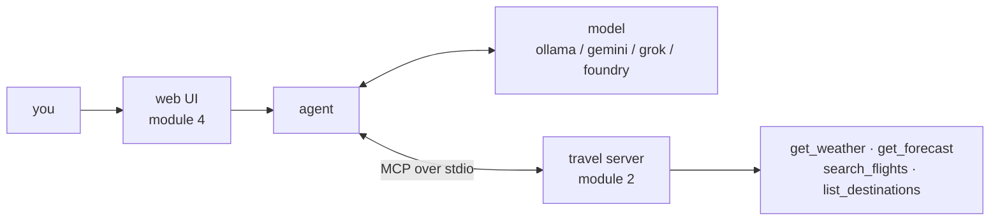

# MCP Workshop

A hands-on introduction to the **Model Context Protocol** in Python. Ninety
minutes to two hours, laptop open the whole time.

By the end you will have built an MCP server, written a complete agent loop by
hand, rebuilt it in ten lines with a framework, and put the result in a browser —
all running locally on a free model, with the wifi off if you like.

> Written against MCP revision **`2026-07-28`** and Python SDK **`mcp` 2.0**.
> Both are recent, and both broke things. Most MCP material online predates them;
> this workshop calls out the differences as it goes.

---

## Why this exists

Everyone is building integrations between language models and their own systems,
and everyone is building them slightly differently. MCP is the attempt to stop
that — one protocol, so a tool written once works with any model, in any host
application, in any language.

The idea is not complicated. The confusing part right now is that the protocol
went through its largest revision to date in July 2026, the Python SDK shipped a
breaking 2.0 at the same time, and most tutorials you will find were written
before both. So this workshop teaches the current thing and points out where the
older material diverges.

It also deliberately makes you write the agent loop by hand before handing you a
framework — because the loop is about forty lines, and understanding it is the
difference between debugging your agent and guessing at it.

## Who it's for

Python developers who have used an LLM API before. You do not need prior MCP
experience, agent-framework experience, or any model credentials.

You *do* need a laptop with Python 3.10+ and roughly 4 GB free for a local model.

## What you'll walk away with

- A mental model of MCP that survives contact with a real codebase
- A working server you can extend into something you actually use
- The agent loop, written by your own hands — no longer a black box
- An informed opinion on when a framework is worth it
- A clear-eyed view of the security problems, which are not the usual ones

---

## Start here

```bash
git clone https://github.com/GlobalAICommunity/mcp-workshop.git
cd mcp-workshop
make setup
make check
```

**Do this before the session** — it downloads a few hundred MB. Full
instructions, including picking a model: **[docs/00-setup.md](docs/00-setup.md)**.

---

## The workshop

| | Module | Time | |
|---|---|---|---|
| 0 | [Setup](docs/00-setup.md) | 5 min | Pre-work check |
| 1 | [MCP basics](docs/01-mcp-basics.md) | 25 min | Concepts, architecture, and what changed in `2026-07-28` |
| 2 | [Build a server](docs/02-build-a-server.md) | 30 min | Tools, structured output, resources, prompts |
| 3 | [A client, and an agent loop](docs/03-raw-client.md) | 25 min | A raw client, then the whole agent loop by hand |
| 4 | [Pydantic AI, and a browser](docs/04-pydantic-ai.md) | 25 min | The same agent in ten lines, then a chat UI |
| 5 | [Where next](docs/05-where-next.md) | 10 min | Remote servers, security, what to build |

**Reference**: [cheatsheet](docs/cheatsheet.md) ·
[glossary](docs/glossary.md) · [models](docs/models.md) ·
[troubleshooting](docs/troubleshooting.md)

**Teaching this yourself?** [docs/facilitator.md](docs/facilitator.md) has timings
with minimums, per-module teaching notes, the questions people always ask, and what
to do when the demo breaks.

*Running short? The resource and prompt in module 2, the Inspector step, and
module 5 can each be demoed rather than typed — that brings it back to ~90 min.*

---

## What you build

A fake travel service — weather, forecasts and flights. Fake on purpose: no API
keys, no network, and the same answer every time, which matters when you are
demoing in front of a room.



Work in `src/starter/` — stubs with numbered TODOs. `src/solution/` has the
finished version of every file if you get stuck or fall behind.

---

## Models

You need something that can call tools. The default is **Ollama** running
`qwen3:4b` locally: free, no account, works offline — and verified end to end for
this workshop, including multi-step tool chains.

Can't run a local model? **Google Gemini**, **xAI Grok** and **Microsoft
Foundry** are one-line swaps in `.env`. See [docs/models.md](docs/models.md).

```bash
MCP_WORKSHOP_PROVIDER=ollama   # ollama | google | grok | foundry
```

---

## Repo layout

```
docs/           the workshop, in order
src/
  starter/      stubs with TODOs — work here
  solution/     the finished reference
  model_config.py
scripts/
  verify_setup.py     make check
  raw_jsonrpc.sh      poke the server with no SDK at all
  download_web_ui.py  vendor the chat UI for offline use
```

Two virtualenvs, deliberately — `.venv` for the server (`mcp` 2.0) and
`.venv-agent` for Pydantic AI (FastMCP, `mcp` 1.x). Those pins are incompatible,
and [module 4](docs/04-pydantic-ai.md) turns that into the best argument for MCP
in the whole workshop.

---

## Licence

[MIT](LICENSE). Use it, fork it, run it at your own event.
