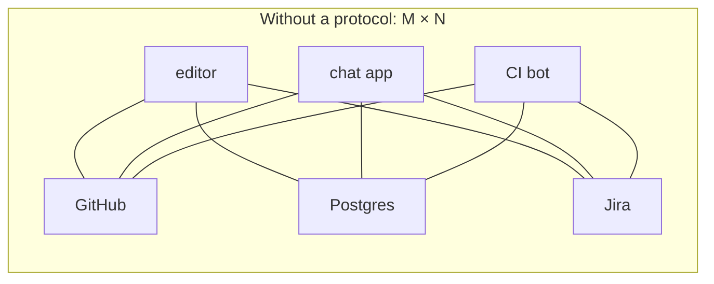
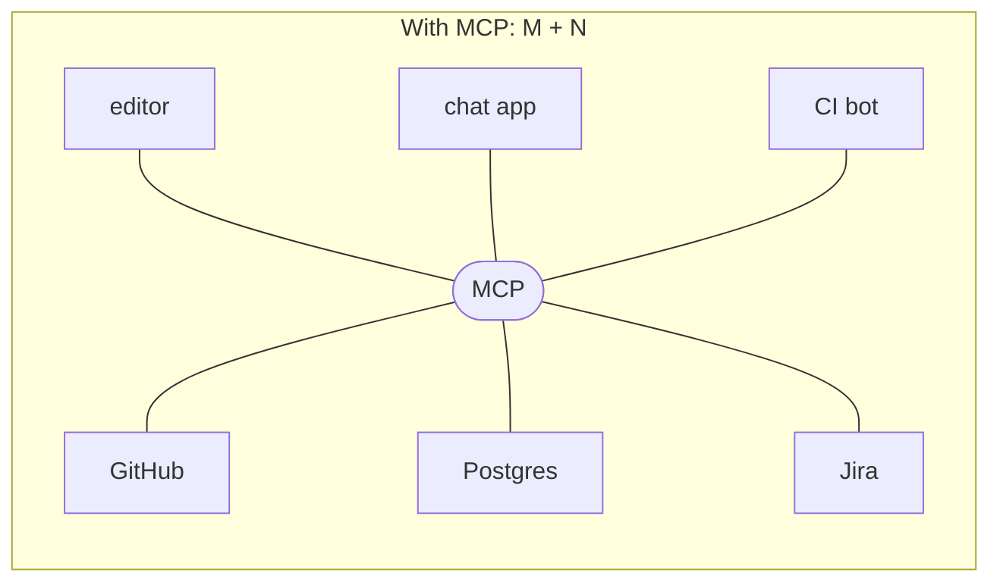
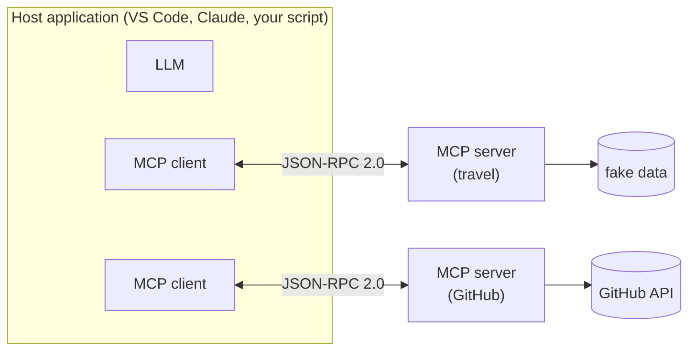

# 01 — MCP basics

*~25 minutes. Concepts first, then a demo that makes them concrete.*

> These docs are written against MCP revision **`2026-07-28`** and the Python SDK
> **`mcp` 2.0.0**. Both are recent and both changed a lot. Where something differs
> from what you will find in older tutorials, it is called out explicitly — and
> there is a lot of older material out there.

New to the vocabulary? [glossary.md](glossary.md) defines every term used here.

---

## Why this exists

A language model on its own is a text predictor with a frozen snapshot of the
world. It does not know your codebase, your tickets, today's date, or what is in
your database. Everything interesting you want it to do requires reaching
*outside* the model.

So every AI application grows the same appendage: a layer that fetches context and
performs actions. And for a couple of years everyone built that layer from
scratch, privately, in incompatible ways.

### The M×N problem

You have **M** AI applications — an editor assistant, a chat app, an internal
agent, a CI bot. You have **N** systems you want them to reach — GitHub, Postgres,
Jira, the filesystem, an internal API.

Wire each pair up by hand and you write **M × N** integrations. Each one bespoke,
each one maintained separately, each one rotting on its own schedule. Four
applications and five systems is twenty integrations, and every new tool you adopt
means five more.

MCP makes it **M + N**. Every application speaks MCP, every system exposes MCP,
and anything plugs into anything:





This is deliberately the same argument as USB-C, and — much more precisely — the
**Language Server Protocol**. Before LSP, every editor implemented autocomplete
for every language. After it, a language ships one server and works in every
editor. MCP is explicitly modelled on LSP, by people who had watched it work.

The payoff is not on your first integration. Writing one MCP server is more work
than hardcoding one API call. It pays off at the *N*-th, and it pays off when
somebody else's host connects to your server without you doing anything.

### Why it caught on

MCP was open-sourced by Anthropic in November 2024. Two things made it stick where
similar proposals had not: it was **boring** — JSON-RPC, no new wire format,
nothing to learn if you have written an API — and it shipped with **working
clients on day one**, so writing a server got you something immediately.

It is now governed under the Linux Foundation, as *"Model Context Protocol, a
Series of LF Projects, LLC"*. That matters mainly as a signal: it is not one
vendor's private format, and adopting it is not a bet on one company.

### What people actually build

Real MCP servers in the wild look like:

- **GitHub / GitLab** — issues, PRs, code search
- **Databases** — read-only query access with sensible limits
- **Filesystem** — scoped to a directory
- **Browser automation** — Playwright driving a real browser
- **Observability** — Sentry, Grafana, log search
- **Internal glue** — the runbooks, deploy scripts and admin APIs that make up
  most of the actual value at any given company

That last category is the point of this workshop. The interesting servers are
usually the boring internal ones, and nobody is going to write those for you.

---

## The architecture



**Host** — the application the user is actually using. It owns the model and
decides what it is allowed to do. VS Code, Claude Desktop, or the fifty lines of
Python you write in module 3.

**Client** — one connection to one server. A host runs several, one per server.
Note this is a narrow technical role; the thing a user sees is the *host*. This
naming trips people up constantly.

**Server** — exposes some capability. Usually small and boring, which is good. The
one you build in the next module is ~200 lines including its fake data.

Underneath it is **JSON-RPC 2.0**: a request has `method` and `params`, a response
has `result` or `error`. Nothing more exotic than that, and you will see it raw at
the end of this module.

The critical property: **the server has no idea what model is on the other end,
and does not care.** You will prove this to yourself in module 4 by swapping model
vendors with one environment variable while the server keeps running.

---

## What a server exposes

Three primitives, distinguished by *who is in control*. This is the part people
most often get wrong, and getting it straight now will save you confusion later:

| Primitive | Controlled by | Think of it as | Example |
|---|---|---|---|
| **Tools** | the **model** | a POST endpoint | `get_weather(city)` |
| **Resources** | the **application** | a GET endpoint / a file | `travel://destinations` |
| **Prompts** | the **user** | a slash command | `/plan_a_trip` |

**Tools** are what most people mean when they say MCP. The model decides, mid-
conversation, to call one. Each has a name, a description the model reads, and a
JSON Schema for its arguments. Because the model chooses based on that text, the
description is not documentation — it is part of your program's behaviour.

**Resources** are context the *host* chooses to include. The model does not decide
to fetch them. Reference data, file contents, a schema dump. If you find yourself
wanting the model to fetch a resource on demand, you actually want a tool.

**Prompts** are templates the *user* deliberately picks, surfaced as slash commands
or menu items. This is how you ship an expert workflow rather than making every
user reinvent the wording.

A rough rule: **can the model call it?** → tool. **Does the app inject it?** →
resource. **Does the user pick it?** → prompt.

---

## Transports

Two, and only two:

**stdio** — the client launches the server as a subprocess and talks over
stdin/stdout. Local, no ports, no auth to configure, dies with its parent. This is
what the workshop uses and what most desktop integrations use.

> One consequence worth burning into memory: **stdout is the protocol channel**.
> A stray `print()` in a stdio server corrupts the stream and produces
> spectacularly confusing failures. Log to stderr.

**Streamable HTTP** — for remote servers, over HTTP POST. Add OAuth 2.1 and you
have something you can host for other people.

The old HTTP+SSE transport is deprecated. If a tutorial has you setting up an SSE
endpoint, it predates the current spec — which is a useful smell test for MCP
material generally.

---

## What changed in `2026-07-28`

This is the largest revision since MCP launched, and it is why most MCP material
online no longer matches reality. Worth knowing even if you only ever touch an SDK,
because it explains a lot of confusing search results.

### MCP is now stateless

**Gone**: the `initialize` / `notifications/initialized` handshake, and the
`Mcp-Session-Id` header.

Previously a client had to open a session, negotiate capabilities, and keep it
alive. Now every request is self-contained: protocol version, client capabilities
and client info ride along in a `_meta` envelope on each call.

Why it matters: a stateless server is just a function behind a load balancer. No
sticky sessions, no session store, no reconnection logic. It makes hosting an MCP
server roughly as hard as hosting any other HTTP endpoint, which is to say: not.

A new **`server/discover`** RPC replaces the handshake for finding out what a
server can do. It is an ordinary request, so you can call it whenever you like, or
never.

### Server-initiated requests are gone

`sampling`, `roots` and `logging` — where the server called back into the client —
are **deprecated** on a 12-month lifecycle.

They are replaced by **MRTR** (Multi Round-Trip Requests): if a server needs more
information, it returns `resultType: "input_required"` instead of calling you back.
The client gathers what is needed and retries.

Same outcome, but traffic only ever flows one direction. That is what makes the
statelessness above possible — a server that might call you back needs a live
connection to call back *on*.

### Everything else

- **Tasks** — long-running work — moved out of core into an official extension,
  `io.modelcontextprotocol/tasks`, alongside a new reverse-DNS extensions
  framework. Core got smaller; that is a good sign for a maturing protocol.
- Tool `inputSchema` / `outputSchema` are now full **JSON Schema 2020-12**.
- Streamable HTTP lost its GET endpoint and SSE resumability; `Mcp-Method` and
  `Mcp-Name` headers are now required.

### And in the Python SDK (`mcp` 2.0)

| v1 | v2 |
|---|---|
| `from mcp.server.fastmcp import FastMCP` | `from mcp.server import MCPServer` |
| `stdio_client` + `ClientSession` + `await session.initialize()` | `Client(...)` |
| `tool.inputSchema`, `result.isError` | `tool.input_schema`, `result.is_error` |

The wire format is still camelCase; only the Python attribute names changed. If
you see `inputSchema` in JSON and `input_schema` in Python, both are correct.

**Backwards compatibility is real.** An `mcp` 2.0 server still serves old-era
clients. You will rely on this in module 4, where a FastMCP-based client on
`mcp` 1.x drives the 2.0 server you are about to write — without either side
being aware of the difference.

---

## Demo: it really is just JSON on a pipe

Nothing makes MCP click faster than skipping the SDK entirely.

```bash
./scripts/raw_jsonrpc.sh
```

That pipes a single line of JSON into a server's stdin. Note there is **no
handshake first** — that is the 2026-07-28 change, live:

```json
{
  "jsonrpc": "2.0", "id": 1, "method": "server/discover",
  "params": {
    "_meta": {
      "io.modelcontextprotocol/protocolVersion": "2026-07-28",
      "io.modelcontextprotocol/clientCapabilities": {}
    }
  }
}
```

and back comes:

```json
{
  "jsonrpc": "2.0", "id": 1,
  "result": {
    "capabilities": { "prompts": {...}, "resources": {...}, "tools": {...} },
    "instructions": "A fake travel assistant backend...",
    "supportedVersions": ["2026-07-28"],
    "resultType": "complete"
  }
}
```

Try the others:

```bash
./scripts/raw_jsonrpc.sh tools/list
./scripts/raw_jsonrpc.sh tools/call '{"name":"get_weather","arguments":{"city":"Tokyo"}}'
```

Three things to notice in `tools/list`:

1. **`inputSchema` is plain JSON Schema.** This is exactly what gets handed to the
   model. No translation happens anywhere — which is why MCP tools work with any
   model API that accepts tool definitions.
2. **`outputSchema` exists too**, so results can be structured data rather than
   text a client has to scrape.
3. **The descriptions are your docstrings.** You are writing the model's
   instructions when you write them.

Everything from here on — the SDK, the client library, the agent framework, the
browser UI — is a convenience wrapper over exactly this.

---

## Check yourself

Before moving on, you should be able to answer:

- Why is M+N better than M×N, and when does that stop being true?
- What is the difference between a tool, a resource and a prompt?
- Why does a stray `print()` break a stdio server?
- What replaced the `initialize` handshake, and why was that worth doing?

---

## Sources

- [Specification `2026-07-28`](https://modelcontextprotocol.io/specification/2026-07-28)
- [Changelog / what's new](https://modelcontextprotocol.io/specification/2026-07-28/changelog)
- [Python SDK](https://github.com/modelcontextprotocol/python-sdk)

---

Next: [02 — Build a server](02-build-a-server.md)
