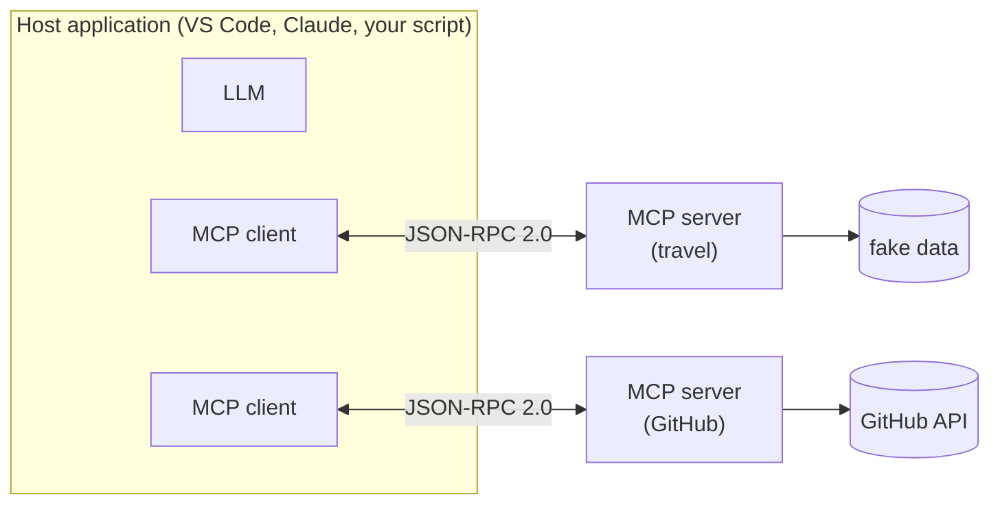

# 01 — MCP basics

*~25 minutes.*

> These docs are written against MCP revision **`2026-07-28`** and the Python SDK
> **`mcp` 2.0.0**. Both are recent and both changed a lot. Where something differs
> from what you will find in older tutorials, it is called out explicitly.

---

## The problem MCP solves

You have **M** AI applications and **N** systems you want them to reach — your
database, GitHub, a ticketing system, the filesystem. Wire each pair up by hand
and you write **M × N** integrations, each one bespoke, each one rotting
independently.

MCP makes it **M + N**. Every application speaks MCP, every system exposes MCP,
and anything plugs into anything. It is deliberately the same argument as the one
for USB-C, or for the Language Server Protocol — and MCP is explicitly modelled
on LSP.

MCP was open-sourced by Anthropic in November 2024. It is now governed under the
Linux Foundation, as *"Model Context Protocol, a Series of LF Projects, LLC"* —
which matters mostly as a signal that it is not one vendor's private format.

## The pieces



- **Host** — the application the user is actually using. It owns the LLM and
  decides what the model is allowed to do.
- **Client** — one connection to one server. A host runs several.
- **Server** — exposes some capability. Usually small and boring, which is good.

Underneath it is **JSON-RPC 2.0**. Nothing more exotic than that.

## What a server exposes

Three primitives, distinguished by *who is in control* — this is the part people
most often get wrong:

| Primitive | Controlled by | Think of it as | Example |
|---|---|---|---|
| **Tools** | the **model** | a POST endpoint | `get_weather(city)` |
| **Resources** | the **application** | a GET endpoint / a file | `travel://destinations` |
| **Prompts** | the **user** | a slash command | `/plan_a_trip` |

Tools are what most people mean when they say MCP. Resources are context the host
chooses to include — the model does not decide to fetch them. Prompts are
templates the user picks deliberately.

## Transports

Two, and only two:

- **stdio** — the client launches the server as a subprocess and talks over
  stdin/stdout. Local, no ports, no auth to configure. This is what we use.
- **Streamable HTTP** — for remote servers. Add OAuth 2.1 and you have something
  you can host.

The old HTTP+SSE transport is deprecated. If a tutorial has you setting up an
SSE endpoint, it is out of date.

---

## What changed in `2026-07-28`

This revision is the largest since MCP launched, and it is why most MCP material
you will find online no longer matches reality. Worth knowing even if you only
ever use an SDK.

### MCP is now stateless

**Gone**: the `initialize` / `notifications/initialized` handshake, and the
`Mcp-Session-Id` header.

Previously a client had to open a session, negotiate, and keep it alive. Now
every request is self-contained: the protocol version, client capabilities and
client info ride along in a `_meta` envelope on each call.

This makes servers dramatically easier to deploy — a stateless server is just a
function behind a load balancer.

A new **`server/discover`** RPC replaces the handshake for finding out what a
server can do. It is a normal request, so you can call it whenever you like, or
never.

### Server-initiated requests are gone

`sampling`, `roots` and `logging` — where the server called back into the client —
are **deprecated**, on a 12-month lifecycle.

They are replaced by **MRTR** (Multi Round-Trip Requests): if a server needs more
information, it returns `resultType: "input_required"` rather than calling you
back. The client gathers what is needed and retries. Same outcome, one direction
of travel, no long-lived connection required.

### Everything else

- **Tasks** — long-running work — moved out of core into an official extension,
  `io.modelcontextprotocol/tasks`, alongside a new reverse-DNS extensions framework.
- Tool `inputSchema` / `outputSchema` are now full **JSON Schema 2020-12**.
- Streamable HTTP lost its GET endpoint and SSE resumability; `Mcp-Method` and
  `Mcp-Name` headers are now required.

### And in the Python SDK (`mcp` 2.0)

| v1 | v2 |
|---|---|
| `from mcp.server.fastmcp import FastMCP` | `from mcp.server import MCPServer` |
| `stdio_client` + `ClientSession` + `await session.initialize()` | `Client(...)` |
| `tool.inputSchema`, `result.isError` | `tool.input_schema`, `result.is_error` |

The wire format is still camelCase; only the Python attributes changed.

Usefully, **an `mcp` 2.0 server still serves old-era clients**. You will see this
for yourself in module 4, where a FastMCP-based client on `mcp` 1.x drives the
2.0 server you are about to write.

---

## Demo: it really is just JSON on a pipe

Nothing makes MCP click faster than skipping the SDK entirely.

```bash
./scripts/raw_jsonrpc.sh
```

That pipes a single line of JSON into a server's stdin. Note there is **no
handshake first** — that is the 2026-07-28 change, live:

```json
{
  "jsonrpc": "2.0", "id": 1, "method": "server/discover",
  "params": {
    "_meta": {
      "io.modelcontextprotocol/protocolVersion": "2026-07-28",
      "io.modelcontextprotocol/clientCapabilities": {}
    }
  }
}
```

and back comes:

```json
{
  "jsonrpc": "2.0", "id": 1,
  "result": {
    "capabilities": { "prompts": {...}, "resources": {...}, "tools": {...} },
    "instructions": "A fake travel assistant backend...",
    "supportedVersions": ["2026-07-28"],
    "resultType": "complete"
  }
}
```

Try the others:

```bash
./scripts/raw_jsonrpc.sh tools/list
./scripts/raw_jsonrpc.sh tools/call '{"name":"get_weather","arguments":{"city":"Tokyo"}}'
```

Two things to notice in the `tools/list` output: `inputSchema` is plain JSON
Schema — that is what gets handed to the model — and `outputSchema` exists too,
which is how you get structured results rather than scraped text.

Everything from here on is a convenience wrapper over exactly this.

---

## Sources

- [Specification `2026-07-28`](https://modelcontextprotocol.io/specification/2026-07-28)
- [Changelog / what's new](https://modelcontextprotocol.io/specification/2026-07-28/changelog)
- [Python SDK](https://github.com/modelcontextprotocol/python-sdk)

---

Next: [02 — Build a server](02-build-a-server.md)
