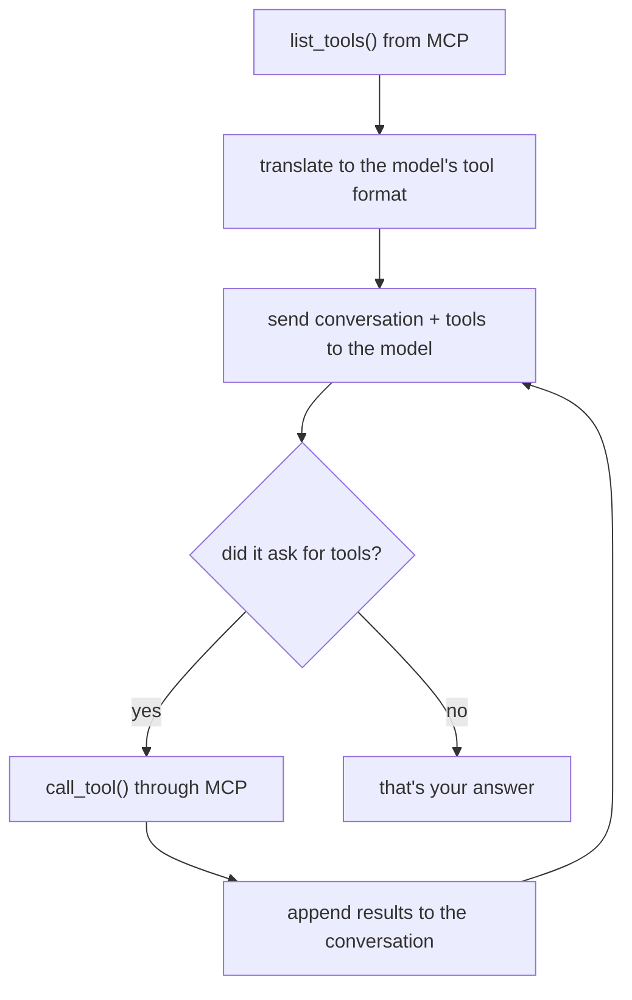

# 03 — A client, and an agent loop

*~25 minutes. The module where "AI agents" stop being magic.*

Two parts. First we talk to the server with no LLM at all. Then we add one, and
write the entire agent loop by hand — because it is about forty lines, and once
you have written it you will never be confused by an agent framework again.

- **Work in**: `src/starter/mcp_client.py`, then `src/starter/agent_raw.py`
- **Solutions**: the matching files in `src/solution/`

---

## Part A — a client, no LLM

*`src/starter/mcp_client.py`*

An MCP client is an entirely ordinary program. It starts the server, asks what it
can do, and calls things. Nothing intelligent is involved.

```python
from mcp import Client, StdioServerParameters, stdio_client

transport = stdio_client(
    StdioServerParameters(command=sys.executable, args=[str(SERVER)])
)

async with Client(transport) as client:
    listing = await client.list_tools()
    result = await client.call_tool("get_weather", {"city": "Amsterdam"})
    print(result.structured_content)
```

> **SDK v1 → v2.** This used to be three nested layers: a transport context
> manager, a `ClientSession` around it, and a manual `await session.initialize()`.
> v2 collapses it into one object — and the `initialize()` call is gone from the
> protocol entirely.

Run it:

```bash
make client
```

Things to look at in the output:

- **`client.protocol_version`** → `2026-07-28`.
- **`result.structured_content`** — typed data, because we returned a Pydantic
  model from the tool.
- **`result.is_error`** — call `get_weather("Atlantis")` and note you get a
  *result*, not an exception. Errors are data.
- **resources and prompts** — different methods (`read_resource`, `get_prompt`),
  because they are different kinds of thing.

---

## Part B — the agent loop

*`src/starter/agent_raw.py`*

Here is the whole thing:



### The only real glue

```python
def mcp_tools_to_openai(tools) -> list[dict]:
    return [
        {
            "type": "function",
            "function": {
                "name": tool.name,
                "description": tool.description or "",
                "parameters": tool.input_schema,
            },
        }
        for tool in tools
    ]
```

`tool.input_schema` passes straight through as `parameters` — both sides are JSON
Schema, so there is no translation to do. That is not an accident; it is why MCP
tools drop into any model API.

*(`input_schema` is snake_case: an SDK v2 change. The wire format is still
`inputSchema`.)*

### The loop

```python
for turn in range(MAX_TURNS):
    response = await llm.chat.completions.create(
        model=model_name, messages=messages, tools=tools,
    )
    reply = response.choices[0].message
    messages.append({...})            # keep the assistant turn verbatim

    if not reply.tool_calls:
        return reply.content          # done

    for call in reply.tool_calls:
        args = json.loads(call.function.arguments)
        result = await mcp.call_tool(call.function.name, args)
        messages.append({
            "role": "tool", "tool_call_id": call.id, "content": text_of(result),
        })
```

Three details that are easy to get wrong:

1. **Append the assistant turn verbatim**, tool calls included. Drop it and the
   model loses track of what it just asked for.
2. **`tool_call_id` must match.** That is how the model pairs a result with its
   request when it calls several tools at once.
3. **Cap the turns.** Models do get stuck in loops, and an uncapped agent talking
   to a paid API is an expensive way to find that out.

### Run it

```bash
make agent Q="What should I pack for a trip to Tokyo?"
```

You will see the tool calls as they happen:

```
[provider=ollama model=qwen3:4b]
Q: What should I pack for a trip to Tokyo?

  -> calling get_forecast({'city': 'Tokyo', 'days': 3})

A: Tokyo looks mild and mostly cloudy — around 12–19°C ...
```

Things worth trying live:

- *"Find me a flight from Amsterdam to Barcelona and tell me the weather there"* —
  forces two different tools.
- *"What's the weather in Atlantis?"* — watch it get the error, read it, and
  recover using `list_destinations`.
- Ask something with no tool for it and watch it just answer.

### Small models wobble

`qwen3:4b` is good but not perfect. Expect it to occasionally skip a tool or
mangle its JSON. The solution handles malformed arguments by telling the model
rather than crashing:

```python
except json.JSONDecodeError:
    output = "Error: arguments were not valid JSON. Try again."
```

If it is too unreliable to demo, `ollama pull qwen3:8b` and set
`MCP_WORKSHOP_MODEL=qwen3:8b`, or switch to a hosted provider — see
[models.md](models.md).

---

## The point of this module

That loop is **the entire idea**. Every agent framework — LangChain, Pydantic AI,
the OpenAI Agents SDK, all of them — is a wrapper around what you just wrote,
plus retries, streaming, tracing, and error handling.

Which makes module 4 a fair comparison rather than a magic trick.

Also worth noting: because every provider this workshop supports speaks the
OpenAI Chat Completions API, **this exact file works against Ollama, Google, Grok
and Microsoft Foundry**. Only `.env` changes. Your MCP server has no idea which
model is on the other end, and does not care.

---

Next: [04 — Pydantic AI, and a browser](04-pydantic-ai.md)
