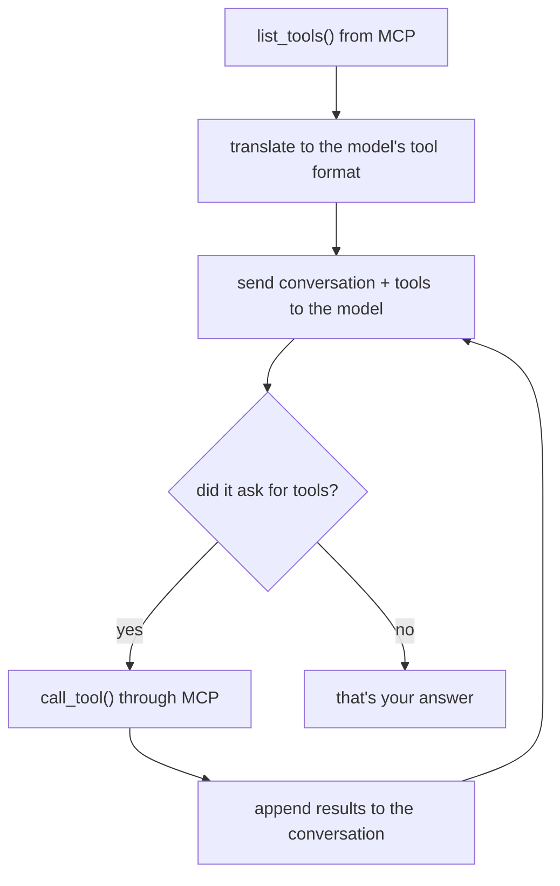

# 03 — A client, and an agent loop

*~25 minutes. The module where "AI agents" stop being magic.*

Two parts. First we talk to the server with no LLM at all, to establish that a
client is an ordinary program. Then we add a model and write the entire agent loop
by hand — because it is about forty lines, and once you have written it you will
never be confused by an agent framework again.

- **Work in**: `src/starter/mcp_client.py`, then `src/starter/agent_raw.py`
- **Solutions**: the matching files in `src/solution/`

---

## Part A — a client, no LLM

*`src/starter/mcp_client.py`*

Before adding a model to the picture, it is worth seeing that an MCP client is
completely mundane. It starts the server, asks what it can do, and calls things.
No intelligence is involved.

```python
from mcp import Client, StdioServerParameters, stdio_client

transport = stdio_client(
    StdioServerParameters(command=sys.executable, args=[str(SERVER)])
)

async with Client(transport) as client:
    listing = await client.list_tools()
    result = await client.call_tool("get_weather", {"city": "Amsterdam"})
    print(result.structured_content)
```

That is the whole API surface you need. `stdio_client` describes *how* to reach the
server (launch this command as a subprocess); `Client` speaks the protocol over it.

> **SDK v1 → v2.** This used to be three nested layers: a transport context
> manager, a `ClientSession` wrapped around it, and a manual
> `await session.initialize()`. v2 collapses it into one object — and the
> `initialize()` call is gone from the protocol entirely, as covered in module 1.

Run it:

```bash
make client
```

Four things in the output are worth pausing on:

**`client.protocol_version`** → `2026-07-28`. Negotiated without a handshake,
because there is no longer a handshake.

**`result.structured_content`** — typed data, because the tool returned a Pydantic
model. Compare it with `result.content[0].text`, which is the same information as
prose. Both ship on every call; different consumers want different ones.

**`result.is_error`** — call `get_weather("Atlantis")` and note you get a *result*,
not an exception. Your program keeps running. This is the design decision from
module 2, seen from the other side: errors are data, because their audience is a
model, not a stack trace reader.

**Resources and prompts use different methods** — `read_resource` and `get_prompt`,
not `call_tool`. They are genuinely different kinds of thing, not tools with a
different label.

Notice what is *absent*: no model, no API key, no prompt. An MCP client is just a
program talking to another program. Everything model-shaped is about to be layered
on top.

---

## Part B — the agent loop

*`src/starter/agent_raw.py`*

### What an "agent" actually is

The word is used loosely enough to be nearly meaningless in marketing, but the
mechanism is precise and small.

A plain model call is one-shot: text in, text out. It cannot look anything up,
because it cannot *do* anything — it can only produce tokens.

Tool calling changes that. You send the model a list of available tools alongside
the conversation, and it can reply with "I would like to call `get_weather` with
`{city: 'Tokyo'}`" instead of with prose. **It does not run anything.** It asks
you to, and waits.

An agent is what you get when you put that exchange in a loop: run what it asked
for, append the result to the conversation, send it back, repeat until it stops
asking. That is it. That is the whole idea:



The "reasoning" people attribute to agents is the model choosing what to call next
given what it has learned so far. The scaffolding around that is what you are
about to write, and it is unglamorous.

### The only real glue

```python
def mcp_tools_to_openai(tools) -> list[dict]:
    return [
        {
            "type": "function",
            "function": {
                "name": tool.name,
                "description": tool.description or "",
                "parameters": tool.input_schema,
            },
        }
        for tool in tools
    ]
```

Look closely at what is *not* happening. `tool.input_schema` passes straight
through as `parameters` — no translation, no mapping table, no per-tool
special-casing. Both sides already speak JSON Schema.

This is the entire integration between MCP and a model API: reshaping a small
envelope around a schema that needs no changes. It is why MCP tools work with any
model provider, and why nobody has to write an adapter per tool.

*(`input_schema` is snake_case — an SDK v2 change. The wire format is still
`inputSchema`.)*

### The loop

```python
for turn in range(MAX_TURNS):
    response = await llm.chat.completions.create(
        model=model_name, messages=messages, tools=tools,
    )
    reply = response.choices[0].message
    messages.append({...})            # keep the assistant turn verbatim

    if not reply.tool_calls:
        return reply.content          # done — it answered instead of asking

    for call in reply.tool_calls:
        args = json.loads(call.function.arguments)
        result = await mcp.call_tool(call.function.name, args)
        messages.append({
            "role": "tool", "tool_call_id": call.id, "content": text_of(result),
        })
```

Three details that are easy to get wrong, and all three produce baffling bugs:

**1. Append the assistant turn verbatim, tool calls included.** The model is
stateless between requests — the `messages` list *is* its memory. Drop the turn
where it asked for a tool and it will have no idea why a tool result just
appeared, and will usually ask again, forever.

**2. `tool_call_id` must match.** When the model requests three tools at once, IDs
are the only thing pairing each result with its request. Mismatch them and you get
plausible-looking nonsense rather than an error.

**3. Cap the turns.** Models do get stuck in loops — calling the same tool
repeatedly, or ping-ponging between two. `MAX_TURNS` is the difference between a
bug and an unbounded bill against a paid API.

### Run it

```bash
make agent Q="What should I pack for a trip to Tokyo?"
```

```
[provider=ollama model=qwen3:4b]
Q: What should I pack for a trip to Tokyo?

  -> calling get_forecast({'city': 'Tokyo', 'days': 3})

A: Tokyo looks mild and mostly cloudy — around 12–19°C ...
```

Nobody told it to call `get_forecast`. It read your descriptions, decided a
packing question needs a forecast, called it, and reasoned over the result.

### Things worth trying

**`"Find me a flight from Amsterdam to Barcelona and tell me the weather there"`**
Two different tools, one question. Watch both calls print. This is the difference
between a lookup and an agent.

**`"What's the weather in Atlantis?"`**
The interesting one. The tool errors, the model reads the message, and recovers —
usually by calling `list_destinations` to find out what is valid. Nothing in your
code handles this case. The recovery is *emergent*, and it only works because the
error message from module 2 was written to be useful.

**`"What's the capital of France?"`**
No tool applies, so it just answers. Models are reasonable about not forcing tools
where none fit — provided your descriptions are specific enough not to look
relevant to everything.

**Pacing note**: on a local model each of these takes roughly 10–75 seconds
depending on how many tools get chained. Run one throwaway query to warm the model
up before demoing, and start a question *before* explaining it rather than after.

### Small models wobble (a bit)

`qwen3:4b` handled every demo question here correctly, including the two-tool chain
and the error recovery. Still, it is a 4B model — occasionally it will skip a tool
or emit malformed JSON. The solution handles that by telling the model rather than
crashing:

```python
except json.JSONDecodeError:
    output = "Error: arguments were not valid JSON. Try again."
```

That is not a workaround, it is the pattern: **feed failures back as text and let
the model retry.** It is what the frameworks do too, with more polish.

If it is too unreliable to demo, `ollama pull qwen3:8b` and set
`MCP_WORKSHOP_MODEL=qwen3:8b`, or switch to a hosted provider — see
[models.md](models.md).

---

## Why this module matters

That loop is **the entire idea**. Every agent framework — LangChain, Pydantic AI,
the OpenAI Agents SDK, all of them — is a wrapper around what you just wrote, plus
retries, streaming, tracing, memory and error handling.

Those additions are real and worth paying for. But you now know what is underneath,
which means when a framework misbehaves you will debug it instead of guessing, and
you can judge whether you need one at all. That makes module 4 a fair comparison
rather than a magic trick.

One more thing worth noticing: because every provider this workshop supports speaks
the OpenAI Chat Completions API, **this exact file works against Ollama, Google,
Grok and Microsoft Foundry**. Only `.env` changes. Your MCP server has no idea
which model is on the other end and does not care — the M+N argument from module 1,
now with running code.

---

## Exercises

1. **Print the whole `messages` list** at the end of a two-tool run. Seeing the
   real transcript — assistant turn, tool result, assistant turn — makes the
   statelessness point concrete.
2. **Set `MAX_TURNS = 1`** and ask a two-tool question. Watch it fail, and
   understand exactly why.
3. **Break a tool description** (module 2, exercise 2) and see tool selection
   degrade.
4. **Add streaming** — pass `stream=True` and print deltas as they arrive.
5. **Run tool calls concurrently** with `asyncio.gather` when the model requests
   several at once. This is a real optimisation frameworks make.
6. **Swap the provider** — `MCP_WORKSHOP_PROVIDER=google make agent Q="..."` — and
   confirm nothing else needs to change.

---

Next: [04 — Pydantic AI, and a browser](04-pydantic-ai.md)
